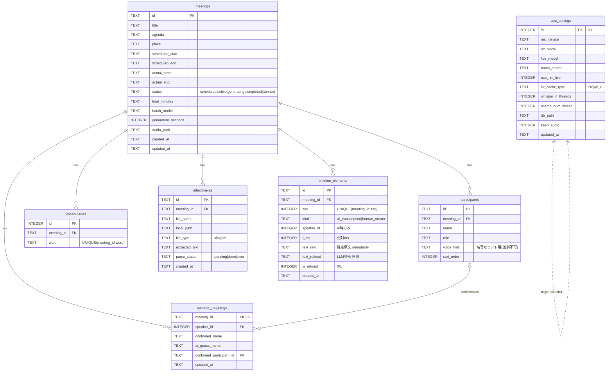

# ER図・テーブル責務（DD-007-3 Phase 1 成果物）

> 入力: [DD-007-1 確定エンティティ](../DD-007-1/状態遷移とエンティティ確定.md) ＋ [DD-007-2 データ辞書](../DD-007-2/データ辞書.md)。物理DDLは [DD-007-4](../DD-007-4_物理設計DDLとDB初期化.md)。

## 1. ER図（Mermaid）

## 2. テーブル責務・主キー・関連・対応画面

| テーブル | 責務（1行） | 主キー | 主なFK / ON DELETE | 対応画面 |
|----------|------------|--------|--------------------|---------|
| `meetings` | 会議の基本情報・状態・最終議事録の集約ルート | id | — | S-01/02/03/06/07 |
| `participants` | 会議の参加者（前提情報・話者確定の選択肢） | id | meeting_id→meetings / CASCADE | S-02/03/05 |
| `vocabularies` | 専門用語辞書（プロンプト補正前提） | id | meeting_id→meetings / CASCADE | S-02/05 |
| `attachments` | 参考資料とパース済テキスト | id | meeting_id→meetings / CASCADE | S-02/03 |
| `timeline_elements` | 確定原文＋整形＋人間メモの時系列（議事録の真実源） | id | meeting_id→meetings / CASCADE | S-03/05 |
| `speaker_mappings` | 仮speaker_id→確定/推測名の対応（表示名導出元） | (meeting_id, speaker_id) | meeting_id→meetings/CASCADE, confirmed_participant_id→participants/SET NULL | S-05 |
| `app_settings` | アプリ全体の実行設定（会議非従属） | id(=1) | — | S-04/08 |

## 3. 設計判断（論点の結論）

- **人間メモを別表にせず `timeline_elements.kind` で統合**: SSOT は単一 timeline＋seq順を真実源とする（[§3.1](../../spec/基本設計書.md#L88-L93)）。別表にすると seq 統合ソートが複雑化するため統合。メモは `speaker_id=NULL`。**メモも挿入時に seq を採番し、読み出しは `ORDER BY seq`**（t_ms は表示用）。SSOT で HumanMemo が seq を持たない点は、永続化時に挿入位置の seq を付与して全順序を確定することで吸収する。
- **speaker_mappings を行=(meeting, speaker_id)・confirmed/ai_guess を列**: 「人間確定＞AI推測」を1行で表現でき、一括置換はこの1行更新＋UI再導出（O(1)）に対応。
- **表示名はテーブルに持たない**: 一括置換時に過去行の文字列を書き換えない（SSOTのちらつき排除設計）。導出は読み取り側。
- **清書バッチの入力（[§6](../../spec/基本設計書.md#L196-L201)）が1会議スコープで取れる**: `meetings`＋`attachments.extracted_text`＋`timeline_elements`(meeting_id, seq順, human_memo含む)＋`speaker_mappings` を `WHERE meeting_id=?` で集約可能（クロス会議結合不要）。

## 4. 主な索引（DD-007-4で実装）
- `timeline_elements(meeting_id, seq)` — タイムライン順次読み出し・清書入力
- `meetings(status, scheduled_start)` — カレンダー一覧（S-01）
- 各子表 `(meeting_id)` — 会議詳細の集約読み出し

## 🔬 機械検証
DD-007-1 の確定7テーブルが全てER図に存在し、孤立テーブル0（app_settings は意図的に独立）。全FKに ON DELETE 方針を明記。
