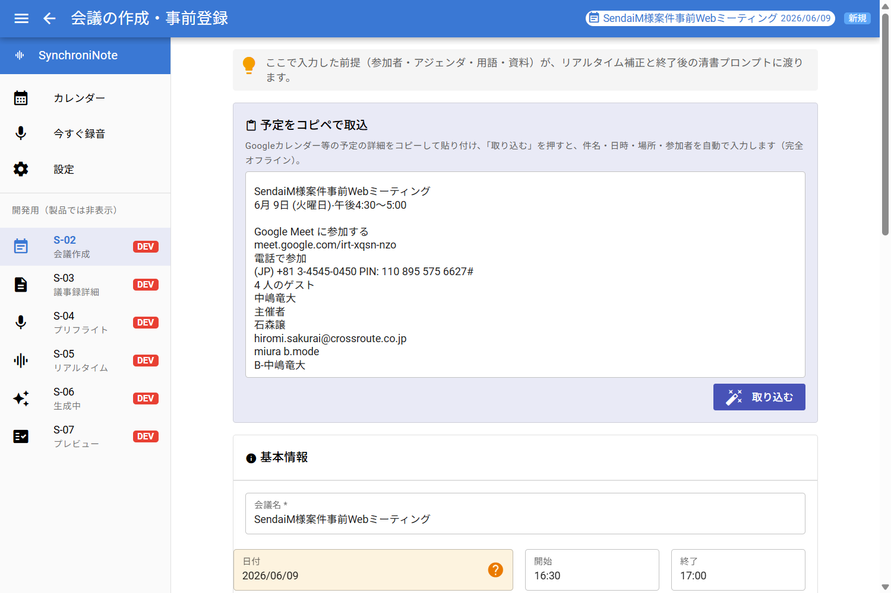
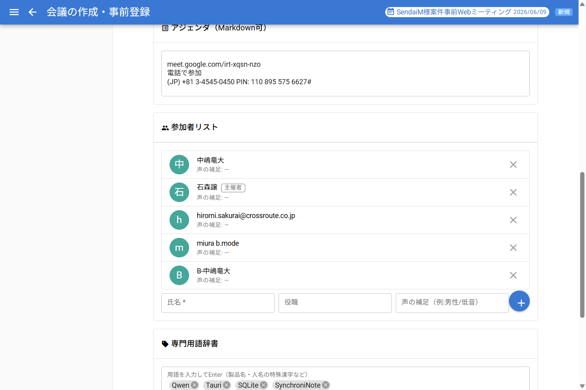
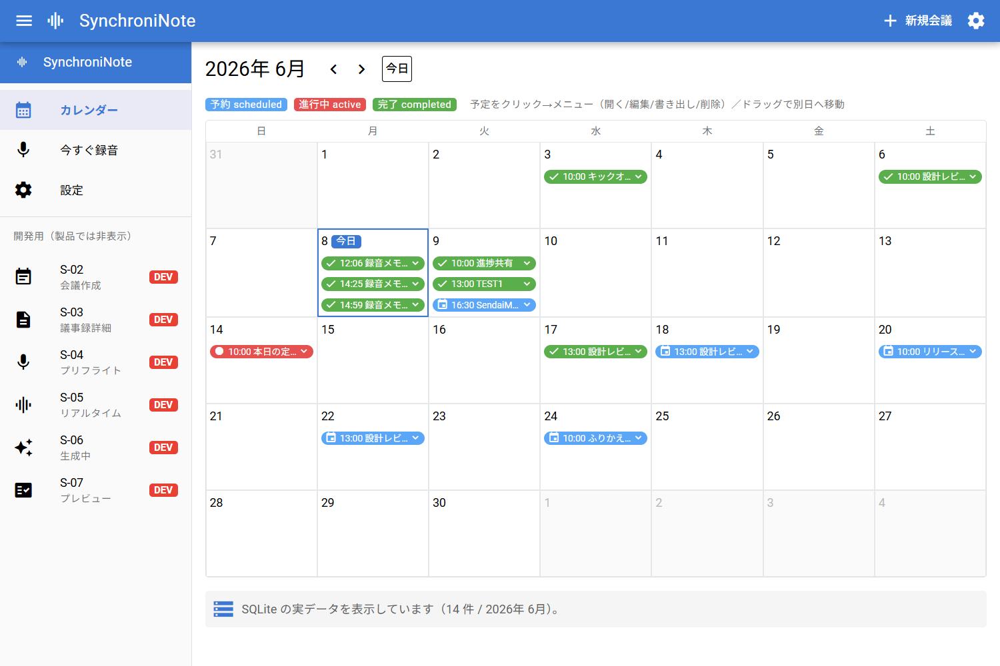

# DD-012-13: カレンダー予定のコピペ取込（テキスト貼付→LLM構造化→会議登録）

| 作成日 | 更新日 | ステータス |
|--------|--------|------------|
| 2026-06-08 | 2026-06-08 | 完了（実機E2E: 貼付→保存→S-01表示まで実DBで確認） |

> アプローチ: 標準（探索的実装）＋実機E2E検証。LLM出力の構造化が中核でTDDが効きにくく、画面は既存S-02の拡張のためモック先行も不要。抽出ロジックのみ pytest で固める。

## 目的

Googleカレンダー等の**予定の詳細テキストをコピペで貼り付ける**と、ローカルLLM（qwen3:8b）が件名・日時・場所・出席者に**構造化**し、内容を確認・修正したうえで**会議（meetings＋participants）として登録**できるようにする。画像解析・Googleログイン・ネット接続なしで「予定の事前登録」を楽にする。

## 背景・課題

- 会議の事前登録（S-02）は現状すべて手入力。カレンダーから1件ずつ写すのが手間。
- 画像（スクショ）解析案は「今の構成は文字専用（ビジョンモデル非搭載）／密集表示は見切れて復元不可」で不採用（→ コピペ＝文字なら正確）と判断済み。
- 検証用に実テキストで読み取りテスト済み。件名・午後表記の時刻・出席者（名前/メールのみ混在）まで文字から正確に取り出せることを確認した。
- 受け皿は既存。`meetings` に `title/scheduled_start/scheduled_end/place/agenda`、`participants` に `name/role` があり、そのまま流し込める（[schema.sql](../spec/db/schema.sql)）。
- セキュリティ方針（完全オフライン・外部送信禁止）に整合：LLM処理はローカル qwen で完結、貼付テキストは外に出ない。

## 検討内容

| 案 | 内容 | 判断 |
|----|------|------|
| 画像→ビジョンLLM | スクショを解析 | ✗ ビジョンモデル未搭載／密集表示は見切れ・重なりで欠落 |
| Google Calendar API(OAuth) | 自動同期 | △ 実装重・完全オフラインの看板と摩擦。将来検討 |
| .ics 取込 | 書き出しファイルを解析 | ○ 正確だが毎回書き出しの手間。別案として併存可 |
| **コピペ取込（本DD）** | 予定テキスト貼付→qwen構造化→確認→登録 | ◎ オフライン完結・実装軽・1件取込が最も楽 |

**配線方針**: 抽出は Python サイドカー（`ollama.generate(model=qwen3:8b, format=json)`）。Rust に取込コマンドを足し、**S-02 のフォームを自動入力**するだけにする＝登録は既存 `create_meeting` 経路をそのまま再利用（新しい保存経路を作らない）。

## 決定事項

- 取込先 = **S-02 会議作成画面**に「予定を貼り付けて取込」欄を追加。取込結果はフォームに反映し、ユーザーが確認・修正して既存の保存ボタンで登録。
- 抽出スキーマ = `{ title, scheduled_start, scheduled_end, place, agenda, participants:[{name, role}] }`（ISO8601・午後表記は24h換算）。
- **年の欠落対応**: 貼付テキストに年が無い場合が多い。**システム年（実行時の現在年）をそのまま補完**する（例: 「6/9」→ 2026/6/9）。補完した日時はフォーム上で**要確認マーキング**し、確定はユーザーに委ねる（年跨ぎ等はユーザーが画面で修正）。
- LLM出力が不正JSON/欠落のときは、取れた範囲だけ反映し残りは空欄（登録を妨げない）。
- 出席者はメールのみ/名前のみ混在を許容（`name` にメール文字列でも可）。後の話者ラベル付けの下ごしらえになる。

## タスク一覧

### Phase 0: 事前精査
- [ ] 📋 **各Phaseのタスク精査・詳細化**（対象パス明記・変更内容具体化・🔬機械検証の有無）
- [ ] 📐 **実装前詳細化トリガー判定**
  - 規模: 新規サイドカー＋新規Rustコマンド＋S-02変更＝**3ファイル以上／新規エンドポイント該当** → **Phase 1・2 は詳細化要**
  - 複雑度: 入力検証（貼付テキスト→構造化）に該当
  - 判定結果: `Phase 1 → 詳細化要 / Phase 2 → 詳細化要 / Phase 3 → 不要（既存フォーム拡張）`
- [ ] 😈 **Devil's Advocate調査**: LLMの日時取り違え（午前/午後・年・タイムゾーン）／JSON崩れ／qwenロード遅延でUX悪化／出席者の重複・空名

### Phase 1: 抽出ロジック（Pythonサイドカー）
- [x] 関数シグネチャ・プロンプト・スキーマ・年補完規則を確定（LLMは抽出のみ、年補完/ISO組立は Python の決定論）
- [x] `python/src/synchroni_note/pipeline/calendar_parse.py` を新規追加（`parse_calendar_text(text, current_year, generate)`＋純関数 `assemble_draft`/`_pad_time`/`_participants`、`ollama.generate(format="json", think=False)`）
- [x] `python/src/synchroni_note/pipeline/calendar_parse_sidecar.py` を追加（stdin `-`→`type=calendar-parse` JSON 1行、`extract` 同型のブロッキング契約）
- [x] 🔬 **機械検証**: `cd python && uv run pytest tests/test_calendar_parse.py -q` → **7 passed**（年補完=システム年・24h換算・メールのみ保持・format/think 呼び出し）。`ruff check` クリーン
- [x] 😈 **DA批判レビュー**（→ 下記 Phase 1 記録）

### Phase 2: Rust取込コマンド＋サイドカー配線
- [x] コマンドI/F確定: 入力は長文のため stdin 流し込み（引数化しない）。ブロッキング `wait_with_output` で1結果取り
- [x] `app/src-tauri/src/lib.rs` に `parse_calendar_text(text) -> Result<Value, String>` を追加（stdin で text 投入→末尾の `type=calendar-parse` 行を拾う）し `invoke_handler` に登録。`cargo check` 通過
- [x] `app/src/api.ts` に `parseCalendarText()` ＋ `ParsedMeetingDraft` 型を追加
- [x] 🔬 **機械検証**: 実窓CDPで `invoke parse_calendar_text`（実サンプル）→ 実qwenが draft 返却（`2026-06-09T16:30〜17:00`・`year_inferred:true`・主催者ロール・メールのみ保持）
- [x] 😈 **DA批判レビュー**（→ 下記 Phase 2 記録）

### Phase 3: S-02 コピペ取込UI（既存フォームへ自動入力）
- [x] `app/src/pages/S02CreateMeeting.vue` に「予定をコピペで取込」textarea＋取込ボタンを追加（新規モードのみ表示）。取込結果で件名・日時・場所・アジェンダ・参加者リストを**フォームに反映**（保存は既存 `createMeeting` 経路のまま）
- [x] 年補完を**視覚マーキング**（日付欄を橙背景＋helpアイコン＋ヒント、手入力で解除）。取込失敗はトースト通知で手入力フォールバック
- [x] 🔬 **機械検証**: 実窓CDPで 貼付→取込→`会議名/2026/06/09/16:30/17:00/場所/参加者5名` のフォーム反映を確認。`vue-tsc --noEmit` 型OK
- [x] 📸 エビデンス（取込後フォームの After を `DD-012-13/` に配置）
- [x] 😈 **DA批判レビュー**（→ 下記 Phase 3 記録）

### Phase 4: 実機E2E通し（CDP直結）
- [x] 実窓（CDP 9222）で S-02 を開き、実サンプルを貼付→取込→フォーム反映→**保存**まで通し実行
- [x] 🔬 **機械検証**: 取込→保存→`list_meetings`/`get_meeting_detail` で実DB登録を確認（`2026-06-09T16:30〜17:00`・status=scheduled・参加者5名persist）＋ **S-01 カレンダーの 6/9 に「16:30 SendaiM…」予約チップ表示**を目視（`DD-012-13/import-after-s01-calendar.png`）
- [x] 😈 **DA批判レビュー**: 誤登録は S-01 の予定クリック→削除（DD-012-9）で取消可能＝リカバリ経路あり

## エビデンス（実機CDP・実qwen3:8b）

実サンプル（SendaiM様案件…のコピペ）を S-02 で貼付→取込した結果。

| After（基本情報＋取込カード） | After（参加者＋アジェンダ） |
|--------|--------|
|  |  |
| 件名・`2026/06/09`(年補完=橙背景＋?アイコン)・`16:30`〜`17:00` を自動入力 | 参加者5名（主催者バッジ・メールのみ可・除去×）／アジェンダにMeet URL・電話/PIN |

**保存後 S-01（実DB反映）**: 6/9（火）に予約チップ「16:30 SendaiM…」が表示。

## ログ

### 2026-06-08
- DD作成。ユーザー要望「Googleカレンダーの予定を取り込みたい」に対し、画像解析→不採用、.ics→併存候補、**コピペ取込を採用**。実テキストで構造化可能を確認済み。
- 年補完規則をユーザー指定で確定: 年欠落時は**システム年**（例「6/9」→2026/6/9）。
- **Phase 1-4 を一気通貫で実装**:
  - Python: `calendar_parse.py`（LLM抽出＋決定論的 `assemble_draft`）／`calendar_parse_sidecar.py`。pytest **7 passed**・ruff クリーン。
  - Rust: `lib.rs` に `parse_calendar_text`（stdin投入・ブロッキング）＋ `api.ts` に `parseCalendarText`/`ParsedMeetingDraft`。`cargo check` 通過。
  - FE: S-02 に「予定をコピペで取込」カード＋年補完マーカー。`vue-tsc` 型OK。
  - **実機E2E（CDP直結・実qwen3:8b）**: 実サンプル貼付→`2026-06-09T16:30〜17:00`・主催者ロール・メールのみ保持でフォーム反映。エビデンス: `DD-012-13/import-after-*.png`。
- **Phase 4 完了**: ユーザー了承のもと S-02 で取込→**保存**まで実行。実DBに `2026-06-09T16:30〜17:00`／参加者5名で登録され、**S-01 の 6/9 に予約チップ表示**を確認（`import-after-s01-calendar.png`）。会議id=`c6c8ab29…`、status=scheduled。誤登録は S-01 削除で取消可能。

---

## DA批判レビュー記録

<!-- 手順・品質フィルター・再チェック条件は doc/da-method.md を参照 -->

### Phase 1 DA批判レビュー

**DA観点:** LLM出力の崩れ・欠落で後段が壊れないか（年欠落・午後表記・JSON非object）。

| # | 発見した問題/改善点 | 重要度 | 再現手順 | DA観点 | 対応 |
|---|-------------------|--------|----------|--------|------|
| 1 | 年欠落テキストで日付が作れない | 高 | 「6/9」のみ貼付 | 欠損入力 | ✅ `assemble_draft` がシステム年補完＋`year_inferred` で UI 要確認表示 |
| 2 | LLMが配列/非objectを返すと `.get` で落ちる | 中 | format崩れ | 異常系 | ✅ `parse_calendar_text` で dict 検証→`ValueError`、sidecar が `status=error` に変換 |
| 3 | 時刻が範囲外/空でISO破綻 | 中 | `start_time="25:00"` | 境界値 | ✅ `_pad_time` が None 化→開始は `00:00` フォールバック |

### Phase 2 DA批判レビュー

**DA観点:** サイドカー一発取りの失敗系（空入力・stdin・前段ノイズ）。

| # | 発見した問題/改善点 | 重要度 | 再現手順 | DA観点 | 対応 |
|---|-------------------|--------|----------|--------|------|
| 1 | 空テキストでLLMを無駄起動 | 低 | 空で取込 | 無駄処理 | ✅ Rust側で `trim().is_empty()` を早期 `Err` |
| 2 | uv 警告行が混ざりJSON取得失敗 | 中 | 初回 uv 解決時 | 出力混在 | ✅ 末尾から `type=calendar-parse` 行のみ採用 |

### Phase 3 DA批判レビュー

**DA観点:** フォーム反映時の既存入力破壊・参加者重複。

| # | 発見した問題/改善点 | 重要度 | 再現手順 | DA観点 | 対応 |
|---|-------------------|--------|----------|--------|------|
| 1 | 取込で参加者が重複追加される | 中 | 2回取込 | 冪等性 | ✅ `splice` で全入替（追記しない）。完了会議は `participantsLocked` で保護 |
| 2 | 年補完マーカーが手修正後も残る | 低 | 補完後に日付編集 | 表示整合 | ✅ 日付 `@update:model-value` で `yearInferred=false` 解除 |

### 残課題（LLM抽出品質・低優先／レビュー単位）

- 実qwenが `place` に会議URLでなくラベル「Google Meet に参加する」を入れ、URLは `agenda` 側へ回る場合がある。実害は小（保存前に確認可）。プロンプト微調整は別途。
- カレンダー名（例「B-中嶋竜大」）が参加者として混入することがある→ユーザーが × で除去可。
- 主催者ロールの紐付け先が実行ごとに揺れる場合あり（LLM分散）。確認・修正前提で許容。
