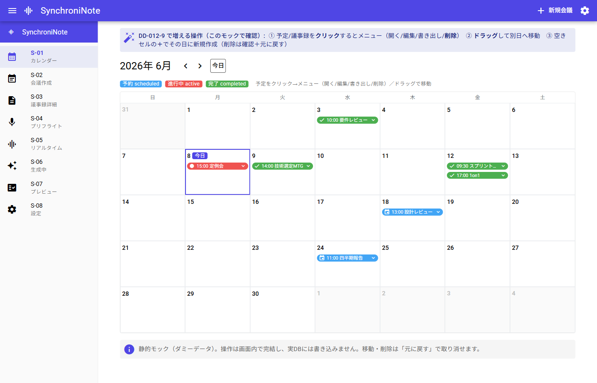
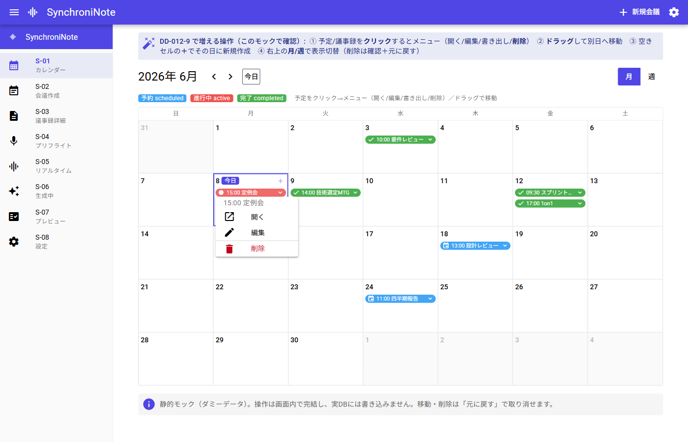
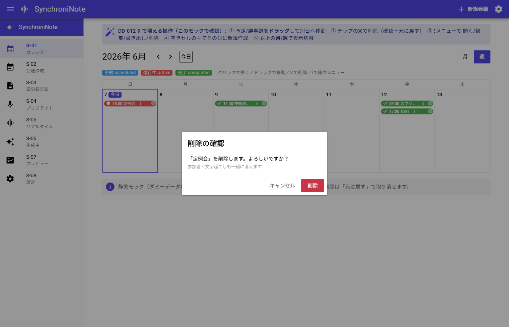
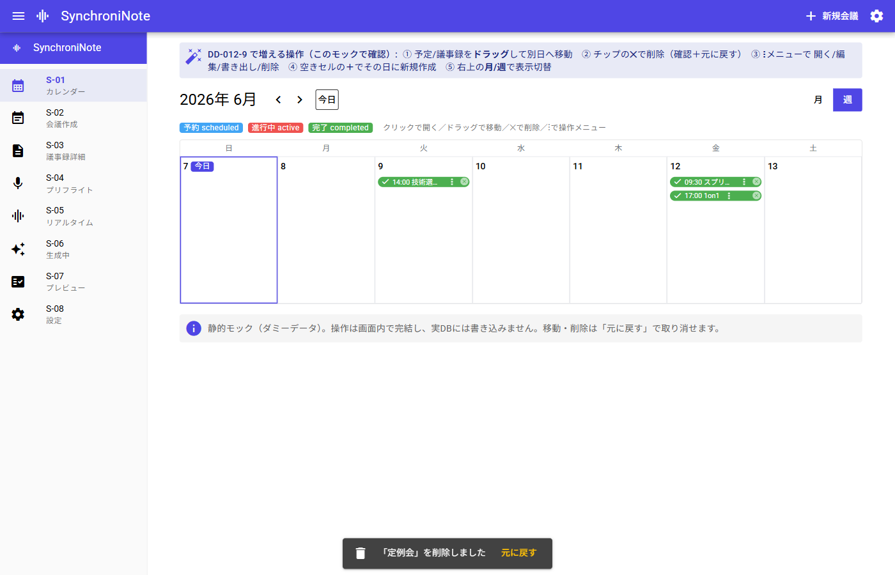

# DD-012-9: S-01 カレンダー操作強化（削除・ドラッグ移動・空き枠作成・編集・書き出し）

| 作成日 | 更新日 | ステータス |
|--------|--------|------------|
| 2026-06-08 | 2026-06-08 | 進行中 |

> 親DD: [DD-012 製品化（中核機能の実装と実用化）](DD-012_製品化_中核機能の実装と実用化.md)
> アプローチ: モック先行（S-01 の操作系を大きく追加するため、見た目・操作感の合意を先に取る）
> 位置づけ: 「画面単位で完成度を上げる」一環。S-01（ホーム/カレンダー）を“予定と議事録を管理する中心画面”へ。

## 目的

S-01 で、既に作成した**予定（scheduled）と議事録（completed）を管理**できるようにする。具体的には ①削除 ②ドラッグ&ドロップで別日へ移動 ③空きセルからその日に新規作成 ④予定の編集 ⑤議事録の書き出し。誤操作に強い形（確認＋元に戻す）で提供する。

## 背景・課題

- 現状 S-01（[S01Calendar.vue](../../app/src/pages/S01Calendar.vue)）は**閲覧と遷移のみ**。作った予定/議事録を消す・直す・動かす手段が無い。
- DBは `meetings` 削除で子（participants/timeline/attachments）が **ON DELETE CASCADE**（[schema.sql](../../doc/spec/db/schema.sql)）。`PRAGMA foreign_keys=ON` は接続ごとに有効（[db.rs](../../app/src-tauri/src/db_commands.rs)）。削除コマンドは未実装。
- 更新系は `update_meeting_status` / `save_final_minutes` の前例あり。日時更新・任意項目更新・削除のコマンドは未実装。
- 既存UIに「月/週」トグルがあるが**未動作のダミー**。週表示は本DDで作らず、**死んでいるトグルを撤去**する（月表示で十分というユーザー判断）。

## 検討内容

- **削除の方式**: まずは**物理削除＋CASCADE**（実装が単純・既存スキーマで完結）。誤削除対策は「確認ダイアログ＋数秒間の“元に戻す”（直前削除分をメモリ保持→`create_meeting` で再INSERT）」で担保。恒久的なゴミ箱（論理削除カラム）は将来（別DD）。
- **移動の方式**: `scheduled_start`/`scheduled_end` のみ更新。**時刻は維持**し日付だけ差し替え、終了は元の所要時間を保って平行移動。
- **操作メニュー**: 予定/議事録チップを**全体クリックで `q-menu`**（開く/編集/書き出し/削除）。✕・⋮ボタンは置かない（1か所に集約）。書き出しは completed のみ表示。
- **編集**: 既存予定を **S-02 を編集モード**（`?id=`）で開き、保存で `update_meeting`（タイトル/日時/場所/アジェンダ/参加者）を更新。
- **書き出し**: `final_minutes`(Markdown) を**クリップボードへコピー**（最小）＋任意でファイル保存。S-01 のメニューと S-03 から。
- モックで全操作を可視化済み（下記エビデンス）。実装は段階Phaseに分割。

## 決定事項

- 削除＝物理削除＋CASCADE＋「確認＋元に戻す」。論理削除ゴミ箱は将来。
- 操作は**チップ全体クリックの1メニュー**に集約（✕/⋮なし）。
- 新規 Tauri command: `delete_meeting` / `update_meeting_schedule` / `update_meeting`（編集）。書き出しは clipboard（＋任意 fs 保存）。
- スコープに**含めない（別DD/将来）**: **週表示（月表示で十分・見送り）**／事前資料(Excel/PDF)添付のテキスト抽出（→ DD-012-10）／検索・絞り込み／一覧表ビュー・一括削除／日ビューと時間帯（縦）ドラッグ／繰り返し予定／論理削除ゴミ箱の恒久化。

## タスク一覧

### Phase 0: 事前精査 ✅
- [x] 📋 現状 S-01・更新系前例・schema の CASCADE / foreign_keys を確認
- [x] 📐 詳細化トリガー判定 → **詳細化要**（新規コマンド3本＝外部I/F追加／DB更新系）。Phase 2-4 は実装前に関数シグネチャを本DDに明記してからコーディング
- [x] 😈 Devil's Advocate（誤削除／ドラッグ暴発／編集の参加者入替）→ 下記 DA

### Phase 1: HTMLモック作成＋レビュー 🎨（レビューゲート）
- [x] 🎨 モック作成: [DD-012-9/mock/S-01_calendar.html](DD-012-9/mock/S-01_calendar.html)（チップのドラッグ移動・**チップ全体クリックで操作メニュー(開く/編集/書き出し/削除)＝削除もメニュー内に集約**・削除は確認＋元に戻す・空きセル＋で新規）
- [x] 🔬 Playwright 目視: 月表示/チップクリックのメニュー/削除確認ダイアログ/元に戻すスナックバー、今日=2026/6/8(月曜)の位置を確認（下記エビデンス）
- [x] 👀 **ユーザー合意（反映済）**: ✕/⋮ は廃止し**予定全体クリックで1メニュー**に集約（書き出しは completed のみ）。**週表示は見送り**（ダミートグルも撤去）。残レビュー点＝削除確認の文言
- [ ] 👀 **ユーザーレビュー継続**（反映版の最終確認）→ **合意後に Phase 2 へ**

### Phase 2: BE（Tauri command＋db.rs＋単体テスト）✅
- [x] 📐 実装前詳細化（シグネチャ確定）:
  - `db::delete_meeting(conn,&id)` = `DELETE FROM meetings WHERE id=?`（子はCASCADE・冪等）
  - `db::update_meeting_schedule(conn,&id,&start,end:Option<&str>,&updated_at)`
  - `db::update_meeting(conn,&Meeting)` = title/agenda/place/予定日時のみ（status・清書本文は不変）
  - `db::delete_participants(conn,&meeting_id)`（編集の全入替前処理）
  - `db_commands` 3本（`update_meeting` は会議行＋参加者入替を1トランザクション）＋`lib.rs` `invoke_handler` 登録＋`api.ts` ラッパー（`deleteMeeting`/`updateMeetingSchedule`/`updateMeeting`）
- [x] 🔬 機械検証: `cargo test --lib` → **17 passed**（新規4: 削除でtimeline/participants連動＋冪等／schedule更新で日時のみ変化／編集でstatus・final_minutes不変／delete_participants）。コンパイル＝`invoke_handler` マクロ展開も通過
- [x] 😈 DA批判レビュー → 下記 Phase 2 DA

### Phase 3: FE（S-01 実装：移動・削除＋元に戻す・操作メニュー・空き枠新規）✅（実装/型チェック）・実機E2EはPhase 5へ
- [x] 📐 実装前詳細化（ドラッグ状態・元に戻すバッファ・メニュー構造／ダミー月/週トグル撤去）
- [x] [S01Calendar.vue](../../app/src/pages/S01Calendar.vue): チップ `draggable`(scheduled/completedのみ)＋セル drop で `update_meeting_schedule`（時刻維持・所要時間維持・移動も元に戻す付き）／**チップクリックで `q-menu`（開く/編集/書き出し(completedのみ)/削除）**／削除は確認(`$q.dialog`)→`delete_meeting`→`$q.notify` で元に戻す（削除前に `get_meeting_detail` を退避し `create_meeting` で復元）／空きセル＋→`/s02?date=`／**未動作の月/週トグルを撤去**。`main.ts` で Quasar Dialog/Notify 有効化
- [x] 🔬 機械検証: `vue-tsc --noEmit` → **エラーなし**（全ファイル型クリーン）
- [ ] 🔬 実機E2E（移動/削除/元に戻す）は Tauri ランタイム専用 → **Phase 5 で実ウィンドウ確認**
- [x] 😈 DA批判レビュー → 下記 Phase 3 DA
- 注: **編集・書き出しはメニュー導線のみ設置**（押下＝準備中を通知）。実処理は Phase 4（詳細計画後）で実装。

### Phase 4: 関連画面（予定の編集＝S-02 編集モード／議事録の書き出し）✅（実装/型チェック）・実機E2EはPhase 5へ
- [x] 📐 **実装前詳細化**: [DD-012-9/Phase4_実装前詳細化.md](DD-012-9/Phase4_実装前詳細化.md)
- [x] 👀 **ユーザー合意**: **D1/編集**＝completed は「タイトル等は編集可・参加者は保護」（scheduled は参加者も編集可）。**D2/書き出し**＝**コピーのみ**（ファイル保存は見送り）
- [x] Phase 4a 予定の編集: BE `db_commands::update_meeting` の `participants` を `Option` 化（None=会議行のみ更新＝話者リンク保全）＋テスト追加／[S02CreateMeeting.vue](../../app/src/pages/S02CreateMeeting.vue) `?id=` 編集モード（読込・上書き保存・completed は参加者ロック・`?date=` 初期化）／[S01Calendar.vue](../../app/src/pages/S01Calendar.vue) `editMeeting`→`/s02?id=`
- [x] Phase 4b 書き出し: S-01 メニュー「書き出し」＝`navigator.clipboard` コピー／[S03MinutesDetail.vue](../../app/src/pages/S03MinutesDetail.vue) に「コピー」ボタン（ファイル保存は見送り＝依存追加なし）
- [x] 🔬 機械検証: `cargo test --lib` **18 passed**（新規 `update_meeting_keeps_existing_participants`）／`vue-tsc --noEmit` エラーなし
- [ ] 🔬 実機E2E（編集保存→反映／コピー）は Tauri 専用 → **Phase 5**
- [x] 😈 DA批判レビュー → 下記 Phase 4 DA

### Phase 5: 実機 E2E 確認
- [ ] 🔬 実ウィンドウで一周（新規→移動→編集→削除→元に戻す→書き出し）。エビデンス取得
- [ ] 😈 総合 DA

## 完了条件（DoD）

- S-01 で予定/議事録を**削除**でき、確認と**元に戻す**が効く（CASCADE で子も消える）。
- チップを**ドラッグして別日へ移動**でき、DBの日時が更新される（時刻維持）。
- 予定/議事録を**クリック→1メニュー**（開く/編集/書き出し/削除）で操作できる。未動作の月/週トグルは消えている。
- 空きセルから**その日で新規作成**へ進める。予定を**編集**して保存できる。完了議事録を**コピー/書き出し**できる。

## エビデンス（モック）

| 月表示（今日=6/8 月曜・月/週トグルなし） | チップクリックのメニュー |
|--------|--------|
|  |  |

| 削除の確認 | 元に戻す |
|------------|----------|
|  |  |

## ログ

### 2026-06-08
- **Phase 4 実装（型チェック済）**: 詳細設計（[Phase4_実装前詳細化.md](DD-012-9/Phase4_実装前詳細化.md)）→ユーザー合意（編集=completedはタイトル等のみ・参加者保護／書き出し=コピーのみ）。BE: `update_meeting` の参加者を `Option` 化（None=会議行のみ更新で話者リンク保全）＋テスト（**cargo test 18 passed**）。FE: S-02 編集モード（`?id=` 読込・上書き保存・completed 参加者ロック・`?date=` 初期化）、S-01 `editMeeting`→`/s02?id=`／`exportMinutes`＝clipboard コピー、S-03 に「コピー」ボタン。`vue-tsc` エラーなし。実機E2EはPhase 5。
- **Phase 3 実装（FE・型チェック済）**: `S01Calendar.vue` を操作強化。チップ全体クリックで `q-menu`（開く/編集/書き出し(completed)/削除）、チップ `draggable`（scheduled/completed のみ）→別日 drop で `update_meeting_schedule`（時刻・所要時間維持＋移動の元に戻す）、削除は確認ダイアログ→`delete_meeting`→削除前に `get_meeting_detail` を退避し「元に戻す」で `create_meeting` 復元、空きセル＋で `/s02?date=` 新規、**未動作の月/週トグルを撤去**。`main.ts` で Notify/Dialog を有効化。`vue-tsc --noEmit` エラーなし。**編集/書き出しは導線のみ（準備中通知）→ Phase 4**。実機E2EはPhase 5。
- **Phase 2 完了（BE）**: `db.rs` に `update_meeting_schedule` / `update_meeting` / `delete_meeting` / `delete_participants` を追加（純関数・時計非依存）。`db_commands.rs` に同名 Tauri command 3本（`update_meeting` は会議行更新＋参加者全入替を1トランザクション・FK順）。`lib.rs` の `invoke_handler` 登録、`api.ts` ラッパー追加。`cargo test --lib` で **17 passed**（新規4テスト）。次＝Phase 3（S-01 FE 実装）。
- スコープ変更（ユーザー判断）: **週表示を見送り**。月表示で十分なため、週レイアウトは作らず既存の未動作「月/週」トグルも実装時に撤去する。モック・本DD（目的/検討/決定/タスク/DoD/エビデンス/DA）から週表示を削除。
- モック改訂（ユーザーFB反映）: ✕/⋮を廃止し**予定チップ全体クリックで1メニュー**（開く/編集/書き出し/削除）に集約。削除もメニュー内へ。あわせて**「今日」のベタ書きが7日→正しくは8日(月曜)**だった点を修正（曜日の列配置は元から正しく、JST。実アプリは `new Date()` のローカル値で判定するため問題なし）。Playwright で再確認。
- 起票（親 DD-012 の子）。ユーザー指摘（削除・D&D移動）＋追加合意（編集・元に戻す・空き枠新規・書き出し）をスコープ化。Excel/PDF添付のテキスト抽出は別の子 DD-012-10 に分離。モック先行で [DD-012-9/mock/S-01_calendar.html](DD-012-9/mock/S-01_calendar.html) を作成し Playwright で目視確認。次＝Phase 1 ユーザーレビュー（合意ゲート）。

---

## DA批判レビュー記録

<!-- DA批判レビューの手順・品質フィルター・再チェック条件は doc/da-method.md を参照 -->

### Phase 0 DA（着手前の先出し）

**DA観点:** （誤削除の不可逆性／ドラッグ操作の暴発／編集の参加者入替）

| # | 発見した問題/改善点 | 重要度 | 再現手順（高/中は必須） | DA観点 | 対応 |
|---|-------------------|--------|----------------------|--------|------|
| 1 | **物理削除は不可逆**: CASCADE で議事録本文・タイムラインも即時消滅。1操作で復旧不能だと事故 | 高 | メニュー「削除」→即削除だと取り返しがつかない | データ保全 | 確認ダイアログ＋数秒の「元に戻す」（直前削除をメモリ保持→`create_meeting` 再INSERT）。恒久ゴミ箱は将来。完了議事録は削除前に書き出し導線も用意 |
| 2 | **ドラッグの暴発/誤移動**: クリック（メニュー）とドラッグの区別が曖昧だと、開くつもりが移動になる／進行中(active)を動かすと混乱 | 中 | チップを軽くドラッグ | 操作安全 | 移動確定時に Notify＋元に戻す。active/generating はドラッグ不可（scheduled/completed のみ）を実装方針に。実機で閾値確認 |
| 3 | **編集の参加者更新**: `update_meeting` で参加者を入替する際、子の削除→再INSERT が中途半端だと不整合 | 中 | 編集で参加者を増減 | トランザクション | 1トランザクションで participants 全削除→再INSERT（`create_meeting` と同様の FK 順） |

### Phase 2 DA（実装後）

**DA観点:** （全入替の取りこぼし／無音の no-op／清書本文の巻き添え）

| # | 発見した問題/改善点 | 重要度 | 再現手順（高/中は必須） | DA観点 | 対応 |
|---|-------------------|--------|----------------------|--------|------|
| 4 | **参加者の全入替が破壊的**: `update_meeting` は participants を全削除→渡された配列で再作成。編集フォームが既存参加者を読み込めていない状態で保存すると**全員消える** | 中 | 編集UIで participants 未ロードのまま保存 | データ保全 | Phase 4 の S-02 編集は「現在の参加者を読み込んでから submit」を必須に。frontend は常に**完全な現行リスト**を渡す。空配列＝意図的な全削除のみ |
| 5 | **存在しないIDへの更新/削除が静かに no-op**: `delete_meeting`/`update_*` は 0 行でも `Ok`。UIが「成功」と誤認しうる | 低 | 既に消えたIDを操作 | 異常系 | 削除は冪等が望ましく許容。編集/移動は対象が画面に出ているチップ起点で発火するため実害低。必要なら将来 `changes()==0` を warn |
| 6 | **編集が清書本文を巻き込まない**: `update_meeting` は status/final_minutes/実績時刻を更新文から除外 | 中 | completed 会議を編集→保存 | 責務分離 | SQLで該当カラムを UPDATE 対象から外して担保。テスト `update_meeting_edits_fields_but_not_status_or_minutes` で固定（回帰防止） |

### Phase 3 DA（実装後）

**DA観点:** （クリックとドラッグの競合／元に戻すの完全性／進行中の誤移動）

| # | 発見した問題/改善点 | 重要度 | 再現手順（高/中は必須） | DA観点 | 対応 |
|---|-------------------|--------|----------------------|--------|------|
| 7 | **削除の「元に戻す」が子まで復元できるか**: 物理削除は CASCADE で参加者・タイムラインも消えるため、本体だけ復元すると証跡が失われる | 高 | completed 会議（タイムライン有）を削除→元に戻す | 復元の完全性 | 削除**前**に `get_meeting_detail`（本体＋参加者＋タイムライン）を退避し、`create_meeting(meeting, participants, timeline)` で**まるごと再作成**。id も同一で復元 |
| 8 | **進行中(active)/生成中の誤移動**: ドラッグで進行中会議の日付を動かすと混乱 | 中 | active チップをドラッグ | 操作安全 | `canDrag` を scheduled/completed のみに限定。非対象は `draggable=false`＋`dragstart` で `preventDefault` |
| 9 | **移動も取り消したい**: ドロップ即確定だと誤移動が戻せない | 中 | チップを誤った日へドロップ | 操作安全 | 移動後の Notify に「元に戻す」（旧 start/end を保持し再 `update_meeting_schedule`）。同日ドロップは no-op |
| 10 | **クリック(メニュー)とドラッグの競合**: 同じチップに両方を載せると暴発しうる | 低 | チップを軽くドラッグ/クリック | 操作整合 | クリック＝`q-menu` を開く（遷移はメニュー内「開く」に集約）。ドラッグは別ジェスチャでブラウザが区別。実機で最終確認（Phase 5） |

### Phase 4 DA（実装後）

**DA観点:** （完了会議の話者リンク／編集の取りこぼし／コピーの可用性）

| # | 発見した問題/改善点 | 重要度 | 再現手順（高/中は必須） | DA観点 | 対応 |
|---|-------------------|--------|----------------------|--------|------|
| 11 | **完了会議の参加者入替で話者リンクが切れる**（`confirmed_participant_id` SET NULL） | 中 | completed を編集→参加者変更→保存 | データ保全 | `update_meeting` の participants を `Option` 化。S-02 は completed で参加者を**ロック**し `None` 送信＝参加者に触れない。テスト `update_meeting_keeps_existing_participants` で土台を固定 |
| 12 | **編集で status/清書本文を壊さない**: 編集保存が完了会議の `final_minutes` 等を消すと致命 | 高 | completed を編集→保存 | 責務分離 | S-02 は `editingBase`（読込値）を土台に**編集項目だけ上書き**。BE `update_meeting` も該当カラムを UPDATE 文から除外（Phase 2 テストで固定） |
| 13 | **削除済みIDの編集遷移**: メニュー「編集」後に対象が無いと空フォームに | 低 | 別経路で削除済みの会議を編集 | 異常系 | S-02 `onMounted` で `getMeetingDetail` が null なら「見つかりません」表示（新規作成には流さない） |
| 14 | **clipboard 不可環境**: 何らかの理由で `navigator.clipboard` が使えない | 低 | コピー失敗 | 可用性 | try/catch で失敗通知。本文が空なら「書き出せる議事録がありません」。ファイル保存は将来（依存追加が要るため見送り） |
