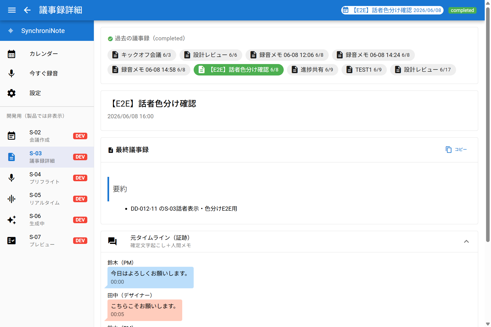
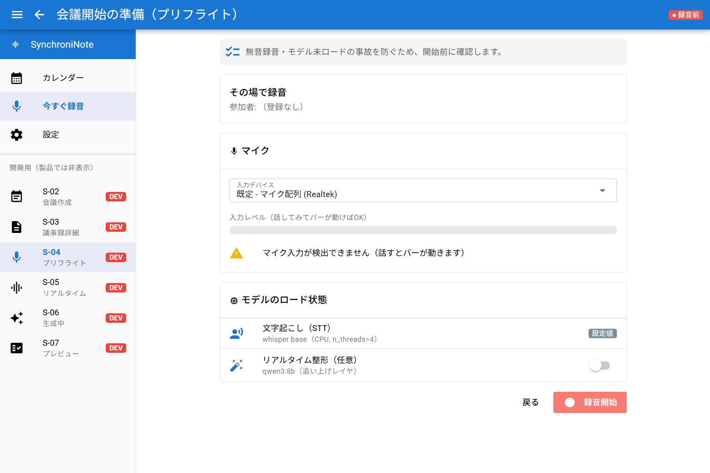
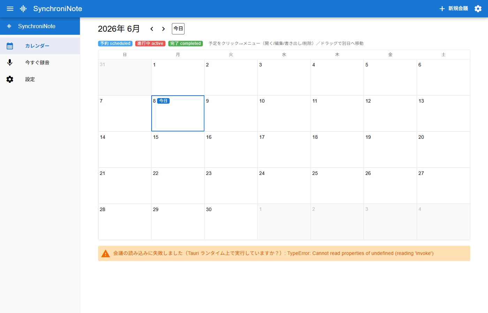

# DD-015: サイドメニュー最終形（DEV/WIP整理と「今すぐ録音」の常設）

| 作成日 | 更新日 | ステータス |
|--------|--------|------------|
| 2026-06-08 | 2026-06-08 | **完了**（実装＋シナリオA/B/C/D検証済・エビデンス取得） |

> アプローチ: E2E駆動（メニュー表示の出し分けと画面遷移の「繋ぎ」が正しいことの検証が中心。繋ぎミス防止が本DDの主目的）

## 目的

開発用に全画面（S-01〜S-08）を並べていた左サイドメニューを、**製品の最終形**へ整える。
- 製品の常設メニューを **カレンダー / 今すぐ録音 / 設定** の3つに絞る。
- S-02〜S-07 の生画面リンクは **開発ビルドのみ DEV バッジ付きで表示**（製品ビルドでは非表示）。
- 動作確認済みの **WIP バッジは全廃**。
- 「今すぐ録音」= 予定を立てずにその場録音できる入口を常設する（中身は既存の ad-hoc 録音）。

## 背景・課題

- 現状 [AppNav.vue](../../app/src/components/AppNav.vue) は S-01〜S-08 を全て並べ、`dev`/`wip` フラグを持つが、**実際の出し分け（製品ビルドで隠す）は未実装**。全項目に WIP/DEV バッジが付いたままで「未完成」に見える。
- 一方、各画面の動作確認は完了（DD-012 系で実機E2E済）。仕上げとして製品メニューへ移行したい。
- ユーザー要望: リアルタイム録音（S-05）は「予定なしでいきなり記録」する使い方があるので、メニューに常設したい。
- リスク: メニュー項目を消すと画面遷移が壊れるのでは？という懸念 → **十分な遷移設計でミスを防ぐ**ことが本DDの主眼。

## 検討内容

### 現状の画面遷移マップ（調査結果）

メニューは単なるショートカット。**実フローの遷移はページ内 `router.push` が担う**ため、メニュー項目を隠してもフローは無傷:

| 遷移元 | きっかけ | 遷移先 | 備考 |
|--------|---------|--------|------|
| S-01 カレンダー | 予定クリック（status別） | /s03?id（completed）/ /s05?id（進行中・生成中）/ /s02（その他） | [S01:152-157](../../app/src/pages/S01Calendar.vue#L152) |
| S-02 会議作成 | 新規（未保存）保存 | ad-hoc 録音へ | [S02:128](../../app/src/pages/S02CreateMeeting.vue#L128) |
| S-04 プリフライト | 「録音開始」 | /s05?id（紐付き）/ /s05（ad-hoc） | [S04:110-114](../../app/src/pages/S04Preflight.vue#L110) |
| S-05 リアルタイム | 「会議を終了」 | /s06 | id無し→ `録音メモ HH:MM` で保存 [S05:296-300](../../app/src/pages/S05Realtime.vue#L296) |
| S-06 生成中 | 完了/戻る | /s05（戻る）→ 保存で /s07 | [S06:128](../../app/src/pages/S06Generating.vue#L128) |

→ **メニューは導線を「省略表示」するだけ。route 定義（[router/index.ts](../../app/src/router/index.ts)）とページ内遷移は本DDでは触らない**ので、フローは保たれる。

### 「今すぐ録音」の繋ぎ（新規入口）

- 入口は **S-04 プリフライト（id無し）** にする（ユーザー選択: マイク確認を一瞬はさむ）。
- S-04 は id 無し起動で `meetingTitle="その場で録音"`、`start_level` でマイクメータ表示 → 「録音開始」で `/s05`（id無し）へ。[S04:56-114](../../app/src/pages/S04Preflight.vue#L56) で確認済み。
- S-05 は id 無し → 終了時 `録音メモ HH:MM` で新規保存。既存 ad-hoc パスをそのまま使う（新規ロジック不要）。

### 最終形メニュー設計（AppNav）

```
■ 常設（import.meta.env.DEV/PROD 問わず・クリーン表示・バッジ無し・id非表示）
  カレンダー    → /s01   icon: calendar_month
  今すぐ録音    → /s04   icon: mic          ← S-05要望の入口（ad-hoc preflight）
  設定         → /s08   icon: settings

■ 開発専用（import.meta.env.DEV のみ・DEVバッジ・S-0X id表示）
  S-02 会議作成    → /s02
  S-03 議事録詳細  → /s03
  S-04 プリフライト → /s04
  S-05 リアルタイム → /s05
  S-06 生成中      → /s06
  S-07 プレビュー  → /s07
```

- WIP 概念は削除（フラグ・バッジ・ツールチップごと）。
- 出し分けは Vite の `import.meta.env.DEV`（`tauri dev`=true / `vite build`=false）で `dev` 項目をフィルタ。route 定義は全件そのまま残す（直接遷移・回帰のため）。

### Devil's Advocate（リスクと対応）

| リスク | 対応 |
|--------|------|
| 「今すぐ録音」(/s04) と 開発S-04(/s04) のハイライトが dev で二重 | dev限定の見た目問題のみ。製品では S-04生リンク非表示で解消。許容（必要なら active 判定を id で分離） |
| 録音中に他メニューへ遷移し録音が宙ぶらりん | 既存挙動（本DDで導入する問題ではない）。S-05 `onUnmounted` の停止処理を回帰確認に含める |
| 設定を将来ヘッダ⚙へ移す構想とズレ | 本DDでは S-08 を常設サイドメニューに維持。⚙移設は別DD（スコープ外）と明記 |
| 製品ビルドのメニュー確認が dev サーバでは出せない | `vite build`→`vite preview` か、本番フラグ相当で確認（Phase1機械検証に明記） |

## 決定事項

1. 常設メニュー = **カレンダー / 今すぐ録音 / 設定** の3項目（クリーン表示・バッジ無し）。
2. S-02〜S-07 の生リンクは **`import.meta.env.DEV` の時だけ DEV バッジ付きで表示**。
3. **WIP は全廃**（フラグ・バッジ・ツールチップを削除）。
4. 「今すぐ録音」の入口 = **/s04（id無し）**。録音実体・保存は既存 ad-hoc を流用（新規遷移ロジックは作らない）。
5. route 定義とページ内 `router.push` は**変更しない**（フロー回帰ゼロを担保）。
6. 設定のヘッダ⚙移設は**本DD対象外**（別DD）。

## タスク一覧

### Phase 0: 事前精査
- [x] 📋 各タスクにファイルパス・具体的変更内容・🔬機械検証があるか確認
- [x] 📐 詳細化トリガー判定: 変更は [AppNav.vue](../../app/src/components/AppNav.vue) 1ファイル中心・新規モジュール無し・外部I/F変更無し → **規模シグナル非該当**。複雑度: 条件レンダリング（dev出し分け）追加のみ → 軽微。**判定: Phase 1 詳細化不要**（ただし遷移設計は本DD検討内容で代替済み）
- [x] 🎭 **E2Eシナリオ設計** → 添付 [`DD-015/e2e-scenarios.md`](DD-015/e2e-scenarios.md) に記述済み。👀 **ユーザーレビュー合意済み（2026-06-08）**
- [x] 😈 Devil's Advocate調査（上表に記載）

### Phase 1: AppNav 最終形化（製品/開発の出し分け＋今すぐ録音常設＋WIP全廃）

**Red（E2Eシナリオを失敗状態で確認）:**
- [x] 合意済みシナリオB/C（製品3項目・開発フル）を現状で確認 → 改修前は全件WIP/DEV表示で**不一致＝Red**

**Green（実装）:**
- [x] [AppNav.vue](../../app/src/components/AppNav.vue) を改修:
  - `NavItem` から `wip` を削除。`PRODUCT`（カレンダー/今すぐ録音/設定）と `DEV_LINKS`（S-02〜S-07）の2配列に再編
  - 「今すぐ録音」: `name:"今すぐ録音", icon:"mic", to:"/s04"`（id無しでad-hoc preflight）
  - 表示フィルタ: `const showDev = import.meta.env.DEV` → `v-if="showDev"` で DEV_LINKS を出し分け
  - レンダリング: 常設項目は `name` のみ・バッジ無し。開発項目は `S-0X` id＋name＋DEVバッジ。WIPバッジ/ツールチップ削除
- [x] 🔬 機械検証（開発ビルド）: 実ウィンドウ `node scripts/tauri-cdp.mjs snapshot`/`shot` → **常設3＋DEV6・WIP無し**を確認（シナリオC・エビデンス dev-menu）
- [x] 🔬 機械検証（製品相当）: `npx vite build && npx vite preview --port 4173` を Playwright MCP で開く → メニューが**カレンダー/今すぐ録音/設定の3つだけ・バッジ/開発用見出し無し**を確認（シナリオB・エビデンス prod-menu）
- [x] 🔬 機械検証（今すぐ録音の繋ぎ）: 実ウィンドウで「今すぐ録音」click → `location.hash="#/s04"`・本文に「その場で録音」・query id 無し を確認（シナリオA前半・エビデンス quickrec-s04）。録音→保存の `録音メモ HH:MM` は既存 ad-hoc パス流用（DD-012-2 既検証）

**Refactor:**
- [x] コード整理（`wip`/旧 `NAV`/不要 tooltip を除去。`npx vue-tsc --noEmit` exit=0）
- [x] 🔬 機械検証: 回帰（シナリオD）— route 定義・各ページの `router.push` は無改修。実ウィンドウで /s03（カレンダー由来）表示・/s04 遷移が正常動作。型チェック通過で配線維持を確認
- [x] 😈 DA批判レビュー（下記記録）

## エビデンス

| シナリオ | After |
|---------|-------|
| C: 開発メニュー（常設3＋DEV6・WIP無し） |  |
| A: 今すぐ録音→S-04（その場で録音・id無し） |  |
| B: 製品メニュー（カレンダー/今すぐ録音/設定のみ） |  |

## ログ

### 2026-06-08
- DD作成（E2E駆動）。現状遷移マップ調査・最終形メニュー設計・「今すぐ録音」入口(/s04 ad-hoc)の繋ぎを確認。E2Eシナリオを添付に整備。
- ユーザー合意（シナリオA/B/C/D）。Phase 1 実装: [AppNav.vue](../../app/src/components/AppNav.vue) を PRODUCT/DEV_LINKS の2配列＋`import.meta.env.DEV` 出し分けに再編、WIP全廃、「今すぐ録音」(/s04)常設。
- 検証完了: vue-tsc exit=0／実ウィンドウCDPでシナリオA・C／vite preview＋PlaywrightでシナリオB／回帰(D)は無改修配線＋型チェックで担保。エビデンス3枚取得。**完了**。

---

## DA批判レビュー記録

### Phase 1 DA批判レビュー

**DA観点:** メニュー項目の出し分け（表示の削除）が、画面遷移フローを破壊しないか？

| # | 発見した問題/改善点 | 重要度 | 再現手順（高/中は必須） | DA観点 | 対応 |
|---|-------------------|--------|----------------------|--------|------|
| 1 | dev ビルドで「今すぐ録音」(/s04) と DEVリンク「S-04」が同時にアクティブ・ハイライトされる | 低 | dev起動→今すぐ録音クリック→両行が青ハイライト | 出し分けの副作用 | ❌不要（製品では S-04 非表示で解消。dev限定の見た目のみ） |
| 2 | 録音中に別メニューへ遷移すると録音が宙ぶらりんになりうる | 低 | S-05録音中に他メニュークリック | 遷移境界 | ⏭️別DD（既存挙動。S-05 `onUnmounted` で `stop_mic` 済のため実害小） |
