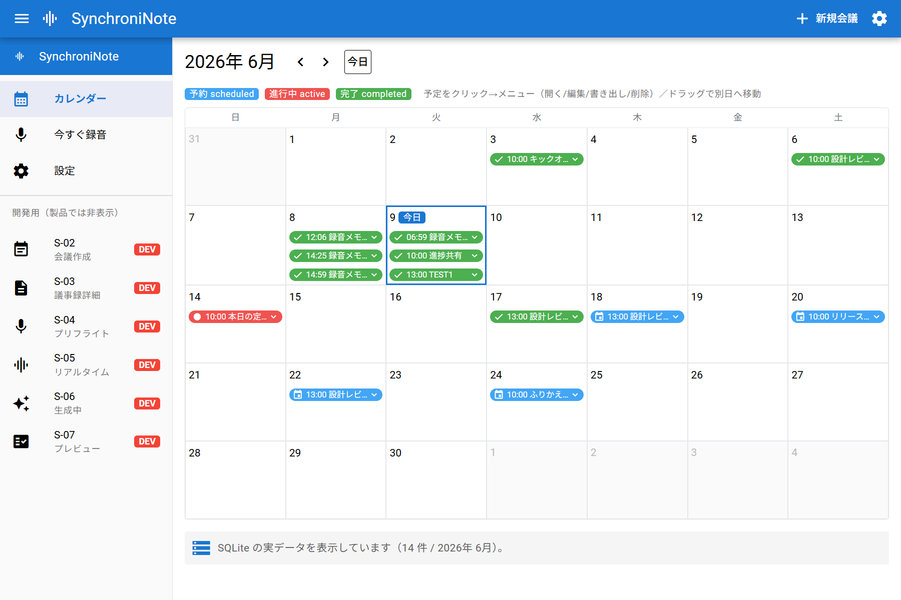
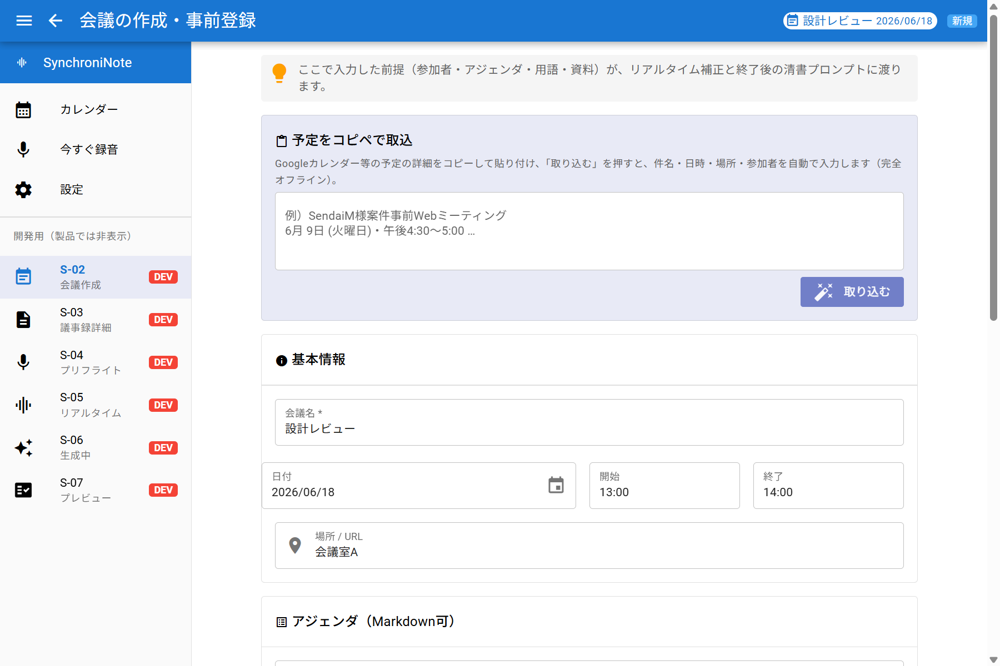
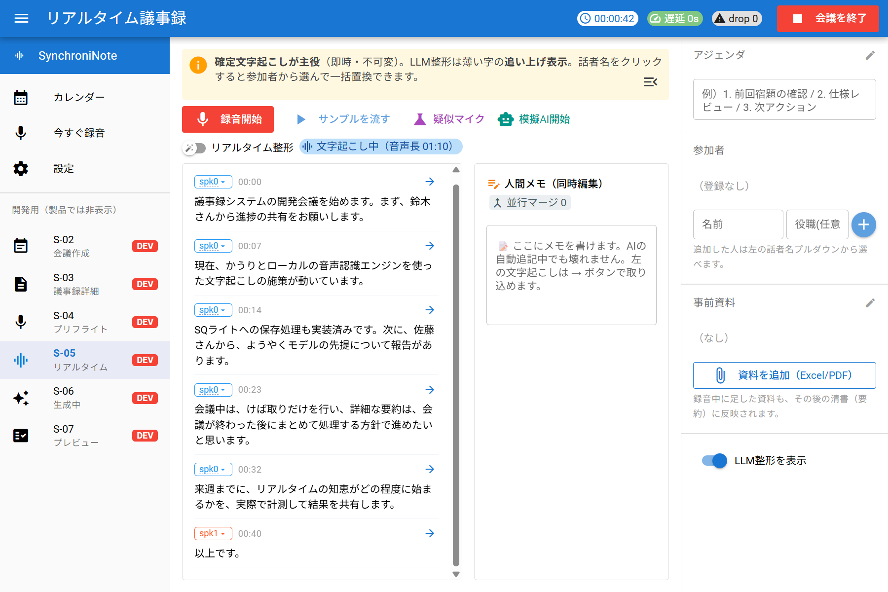
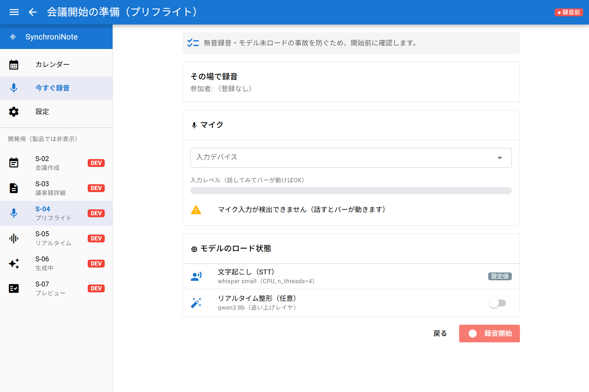
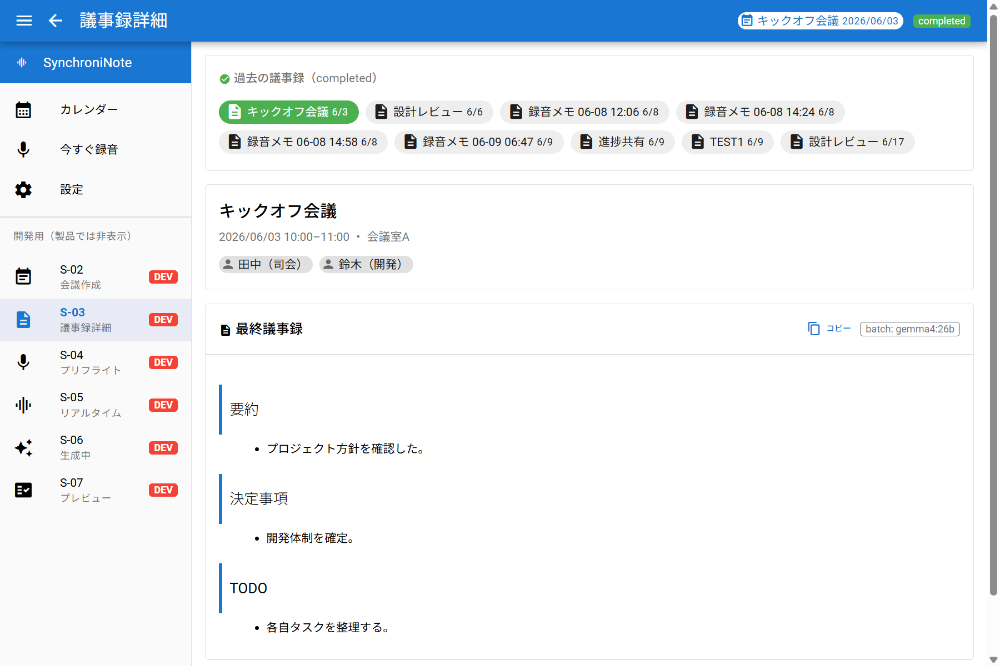
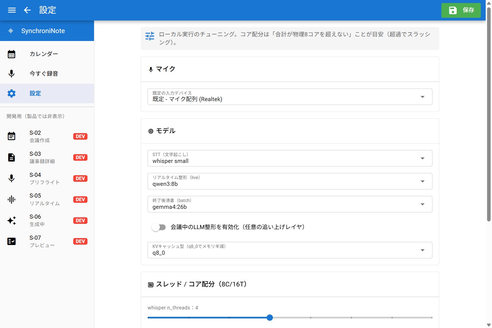
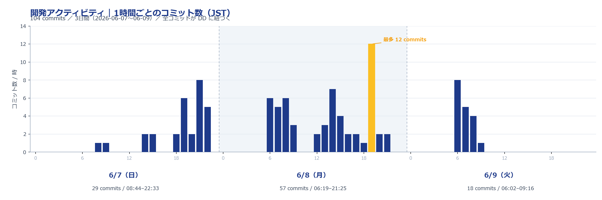

# AIに任せても、破綻しない。

## 再現性のある開発手法「DD」と、その実例 SynchroniNote

ナナイロ ／ 完全オフラインAI議事録 ／ 2026-06

<!-- note:
これは製品紹介ではなく「ナナイロの開発"手法"」の紹介。主役はDD（自社製の設計ドキュメント駆動）と複数LLM運用力。SynchroniNoteはその成果物=Exhibit A。「3日で作った」という速さ自慢は使わない。
-->

# 目次

- 1. 課題 — AI内製の落とし穴（バイブコーディング）
- 2. 開発手法 — DD ＋ 複数LLMの適材適所運用
- 3. 実例：SynchroniNote — 完全オフラインAI議事録
- 4. ローカルLLMの今 — 性能・コスト・セキュリティ
- 5. まとめ — 経営へのメッセージ

<!-- note: 全体の地図。以降の各ページ上部の「章バー」で現在地（章）を示す。前付け（表紙・目次・要点）には章バーを付けない。 -->

# このスライドで伝えたいこと（3行）

- ナナイロは、再現性のある自社手法 **DD** でAIを規律づけて開発している
- だから “バイブコーディング” に陥らず、**専門外の領域でも破綻しない** — 実例が完全オフラインAI議事録 **SynchroniNote**
- 土台にあるのは、**複数のLLMを適材適所で使いこなす**運用力

<!-- note: 経営目線の要点。①手法=再現性 ②破綻しない=脱バイブコーディング ③複数LLM運用力。製品はあくまで実例。 -->

<!-- chapter: 課題 -->

# AI内製の落とし穴 ＝ “バイブコーディング”

一言でいうと：AIに雰囲気で書かせて、動くけれど中身が誰にも分からないコードの山になること

- ⚡ 速い。デモは作れる
- ❌ でも：中身が黒箱／属人化／後で崩れる／品質は運任せ
- 💣 結果＝説明できない技術的負債。これは経営にとってのリスク

> ここを越えられるかが、AI内製が “使い物になるか” の分かれ目

<!-- note: バイブコーディング=AIに雰囲気で書かせる開発。速いが保守不能。ここを越える手法を持っているか、が論点。 -->

<!-- chapter: 開発手法 -->

# 土台：複数のLLMを “適材適所” で使いこなす

ナナイロは「1つの万能AI」に頼らない。それぞれの個性を理解して使い分ける

- 🧠 構想・壁打ち：**Gemini**（広い文脈・長文の設計ドラフト）／ **ChatGPT**（発想・論点整理・別視点の検証）
- 🛠 実装・検証：**Claude（Claude Code）** ＝ コードベースに直結し、実装・実測・UI確認まで回す主戦力
- 🎚 上流は “発想力” のLLM、下流は “実装力” のLLM — この使い分け自体がナナイロの強み

> 「どのAIに、何をやらせるか」を設計できることが、AI活用力の本体

<!-- note: 本件でも企画書の起草はGemini、実装はClaude。適材適所の実例。複数LLMを使いこなす=ナナイロのアピールポイント。 -->

# ナナイロの答え ＝ DD（設計ドキュメント駆動）

DD は、AIを “半自動の実装者” として規律づける、ナナイロ自社製の開発手法

- 着手の前：「何を・なぜ・どう作り・何をもって完了とするか」を1枚にまとめる
- 実装の後：「実測値・決定理由・完了確認」を同じ紙へ書き残す
- 徹底：**1作業 ＝ 1設計書 ＝ 1チケット**

> Claude Code 上の自作スキル /dd で、この一連を回している

<!-- note: DDは自社製スキル。思想ではなく実運用。AIを規律づける仕組み。 -->

# どう回すか：構想から実装まで一本の流れ

- ① 壁打ち（Gemini / ChatGPT）で構想を立てる
- ② 企画書・開発ロードマップ＝ **基本設計** に落とす
- ③ ロードマップの各単位を **DDとして起票**（1作業＝1枚）
- ④ **Claudeが実装＋実測** — 動かして数字を取る
- ⑤ 検証してアーカイブ。判断の根拠が全部残る

> 証跡は **40件超のDD（DD-001〜016）**。すべて開発ロードマップ／DD索引から辿れる

<!-- note: 開発ロードマップ(doc/plan/開発ロードマップ.md)が「各DD候補を起点にDD化」と明記。壁打ち→基本設計→DD→Claudeのパイプラインは文書化済み。 -->

# なぜ破綻しないか ＝ “実測が設計を上書きする”

最初の構想（壁打ちの初期案）の甘いところを、DDの実測ゲートが一個ずつ捕まえて直している

- 初期案「32GBをAIに／Qwen 32B」 → 実測：使えるRAMは約9.6GB → **gemma4:26b へ補正**
- 初期案「1〜3分ごとにリアルタイム要約」 → 実測：CPUでSTTとLLMは同時に回らない → **終了後バッチへ撤回**
- 初期案「STT遅延1秒未満」 → 実測：RTF 0.527 → **一区切り約4秒に現実化**

> 「AIの言いなり」ではない。基本設計書は “要件と食い違えば実測を優先” と明文化 — これがバイブコーディングとの決定的な差

<!-- note: ここが最強の証拠。AIの初期案を実測が補正＝自己修正する手法。バイブコーディング（言いなり）の対極。 -->

# ドメイン知識は要らない。でも、エンジニアリング力は要る。

- 🟢 **床（下限保証）**：STT・オフラインLLMが “初耳” のエンジニアでも、手法に沿えば破綻しない（甘い前提は実測ゲートで落ちる）
- 🔧 **でも最後の仕上げ** — 判断・詰め・品質の作り込みは、**エンジニアリング力がある人にしか出来ない**
- 🚀 **天井（上限突破）**：エンジニアリング力が高いほど、精度は **他社を寄せ付けない**

> DDは “エンジニアリング力の増幅器”。AIはエンジニアを置き換えず、できる人をさらに伸ばす

<!-- note: ユーザーの核心。「誰でもできる」には寄せない。ドメイン未経験でも回せるが、仕上げはエンジニア力が決め手＝エンジニアの価値はむしろ上がる。 -->

<!-- chapter: 実例 -->

# 実例：SynchroniNote ① 会議の「前」

専門外から着手して、破綻なく完成した “専門アプリ” ＝ 手法の成果物（Exhibit A）

- 🗓 カレンダーで予約・管理（予定の作成・移動・削除）
- 📋 予定をコピペで取込 — 案内メールを貼るだけでAIが会議情報に整形
- 📎 Excel / PDF を添付して要点を抽出、要約の文脈に

<!-- note: ここから実例。実データ入りの実画面。専門性の塊のアプリが手法で破綻なく出来た、という証拠として見せる。 -->

# 実例：SynchroniNote ② 会議の「中」 ★中核

- 🎙 話した先から文字起こし — 確定テキストは即・不変で表示（遅延ほぼ0）
- 🧑‍🤝‍🧑 話者を自動で色分け — クリックで参加者名に一括置換
- 📝 人間メモを割り込み — その場の決定事項をタイムラインに差し込み
- 🚦 録音前にマイク・無音をチェックして “無音録音” の事故を防止

<!-- note: 中核S-05。確定テキスト主役・AI整形は追い上げ。右=録音前の事故防止プリフライト。 -->

# 実例：SynchroniNote ③ 会議の「後」＋ 破綻させない作り込み

- 🧠 終了ボタンで自動清書（決定事項・TODO・要約、目安3〜6分）→ 保存でカレンダーに完了
- 🧯 詰まっても文字起こしは止まらない — 重い処理は遅らせ、主役は崩さない設計
- 🙋 人間の確定 ＞ AIの推測 — 話者名はクリック一発で総入れ替え

> “動く” だけでなく “実際の会議で破綻しない” ところまで — ここがエンジニアリングの仕事

<!-- note: 配慮を「後」に統合。エンジニアリング力テーマと接続。S-06生成中/S-07プレビューは録音実行時のみ出る画面のため割愛し文言で補う。 -->

# AIは全部、この1台のPCの中で（完全ローカル）

- 文字起こし：whisper medium ＋ VAD（無音を除くと日本語精度が約5倍改善）
- ライブ整形：Ollama qwen3:8b ／ 終了後の清書：Ollama gemma4:26b（MoE＝26B級の品質を4B級の速度で）
- 話者識別：CAM++ ONNX 埋め込み（モデル未配置でも完全オフラインで代替動作）

> クラウド送信ゼロ。すべてこのPCの中で完結する

<!-- note: 完全ローカルでここまでやれる。右の設定に実モデル名。数値根拠は各DD。 -->

<!-- chapter: ローカルLLM -->

# ローカルLLMで今、何が起きているか

わずか1年で「小型モデルが、昨年の大型モデルに追いつく」時代に

- 🟢 Gemma 4（Google・2026年4月）— 「31Bが400B級に匹敵」と評価。本アプリ採用の 26B MoE は活性わずか約3.8B＝大型の品質を小型の速度で
- 🟣 Qwen3 / Qwen3.5（Alibaba・Apache 2.0）— オープンモデルで Gemini 2.5 Pro と肩を並べる水準に
- 📈 オープンモデルとフロンティア最上位の差は わずか数%／ELO約53pt まで接近

> 「無料で持ち帰れる高性能モデル」が、毎月のように更新されている

<!-- note: 出典 blog.google(Gemma4,2026-04-02)/qwenlm.github.io/llm-stats.com。今が転換点。複数LLM運用力の話とも接続（ローカルも選択肢に入ってきた）。 -->

# 正直な話：コストだけなら、クラウドが安い

- ☁️ Gemini 2.5 Flash：入力 約$0.30 ／ 出力 約$2.50（100万トークンあたり）。会議1本でも数円〜数十円、ハードも不要
- 🖥️ ローカルはマシン性能が必要（本アプリは既存PCで動かすので追加ハード費はほぼ0。ただし速度・メモリの制約は受ける）
- ⚖️ だから “コスト効率だけ” を見れば、クラウドAPIが有利な場面は多い — ここは隠さない

> では、なぜそれでもローカルなのか？ → 次ページ

<!-- note: 出典 ai.google.dev(2026)。潔く認めることで次のセキュリティの説得力が増す。 -->

# それでもローカル：セキュリティは “値段がつかない”

機密会議で問われるのは「いくらか」ではなく「そもそも送ってよいか」

- 🚫 インサイダー情報・顧客の個人情報・規制対象データは、外部送信そのものが許されないことが多い
- 📊 IT責任者の53%が「データプライバシー」をAI活用の最大の障壁と回答（Cloudera 2025・約1,500名）
- 🕵️ 従業員の77%が会社情報をAIに貼り付け、その82%が個人アカウント経由＝ “見えない漏洩”
- ⛔ クラウドに一度送れば取り消せない（モデルに溶けたデータは消せない／EU当局2025）
- ✅ ローカルはデータが1バイトも外に出ない → GDPR・社内規程を自動的に満たす

> コストはクラウド、安心はローカル。機密を扱う現場では “安心” が前提条件 — ローカルLLMの真価は「ローカルであること」そのもの

<!-- note: 出典 Cloudera2025/EU2025/unifiedaihub等。製品の存在意義であり、複数LLM運用の中で「機密はローカル」という判断ができることもナナイロの目利き。 -->

<!-- chapter: まとめ -->

# 手法がもたらす経営価値

- 🔁 **再現性**：判断が全部残る → 監査できる・属人化しない・引き継げる
- 📈 **床と天井**：誰がやっても下限品質を保証し、できる人ほど伸びる
- 🧩 **横展開**：SynchroniNote で実証した手法を、他案件にそのまま適用できる
- 🏰 **堀**：複数LLM運用力 ＋ DD ＝ 競合が素のAIでバイブコーディングしている限り、追いつけない

<!-- note: 経営に刺す一枚。ガバナンス×速度＋増幅器＋横展開＋堀。 -->

# まとめ

- ナナイロは「AIで速く作る会社」ではなく、**「手法でAIを規律づけて作る会社」**
- その実例が、専門外から破綻なく完成した **SynchroniNote**（完全オフラインAI議事録）
- 手法（DD）と複数LLM運用力は、**他案件へ横展開できる組織の武器**

> 速さではなく、再現性。これがナナイロのものづくり。

<!-- note: 手法で締める。製品→手法→組織の武器に着地。 -->

<!-- appendix -->

<!-- wide -->

# 付録：開発アクティビティ（コミット推移・JST）

- 日曜の朝に着手 → 月曜は早朝6時から夜21時台まで → 火曜の早朝に追い込み。**104コミットすべてがDDに紐づく**
- 「速い」のではなく、再現性ある手法に乗った “高密度な集中” の記録 — 一人の手で

<!-- note: 出典=本リポジトリの git log（JST=epoch+9h）。build_commit_chart.py で再生成可能。“3日”を速さでなく密度・情熱として見せる。 -->

<!-- dd-table -->

# 付録：DD一覧（DD索引から自動生成）

<!-- note: doc/DD/DD-INDEX.md から自動生成（件数・件名はビルド時に反映）。bash scripts/dd-index-gen.sh で最新化。 -->

# 付録：動作環境・技術スタック

- 実機：Windows 11 ／ Ryzen 7 PRO 8840HS（AVX-512）／ GPUなし ／ RAM 59.7GB（実質約9.6GB）
- スタック：Tauri（Vue3 + Quasar）/ Rust ＋ Python評価ハーネス ＋ Ollama
- 進め方：評価はPythonで速く回し、速度が要るホットパスだけRustへ移植
- 設計の正：企画書 → 開発ロードマップ → 基本設計書（SSOT）→ DD索引、と辿れる

<!-- note: 技術的な質問に備えた控え。普段は飛ばしてOK。 -->

# 付録：出典（ローカルLLM動向・コスト・安全性）

- Gemma 4（Google, 2026-04-02）— blog.google ／ 26B MoE・活性約3.8B
- Qwen3（Alibaba, 2025-04, Apache 2.0）— qwenlm.github.io
- オープン vs フロンティアの収束 — llm-stats.com ／ till-freitag.com（2026）
- Gemini API 料金（2026）— ai.google.dev/gemini-api/docs/pricing
- オンプレLLMのプライバシー優位・Cloudera 2025調査 — unifiedaihub.com ／ digitalapplied.com

> アクセス：2026-06。数値・料金は変動するため、提示時に最新を確認すること。

<!-- note: 裏取りの提示。配布版に残す。発表では飛ばしてOK。 -->
