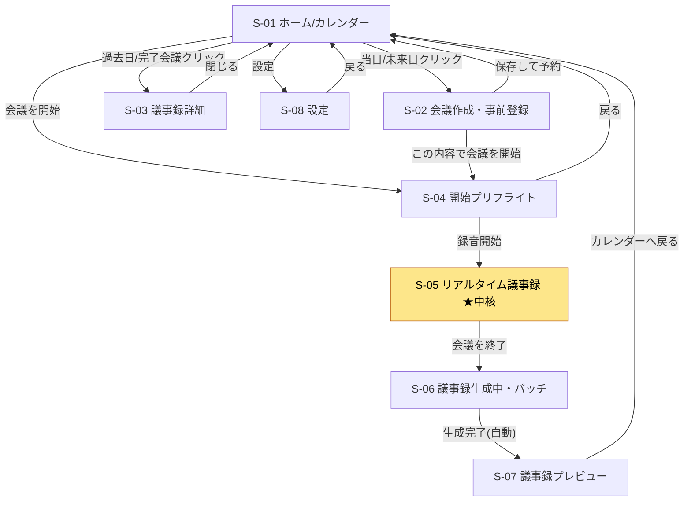

# 🖼️ SynchroniNote 画面モック — 画面一覧・機能概要・画面遷移図

最終形（製品期：Tauri + Quasar）の **画面イメージを固めるための叩き台** です。まず本書で「どんな画面があるか／各画面で何ができるか／どう遷移するか」を合意し、その後に各画面の **HTMLモック**（`doc/mock/html/`）を起こします。

> ⚠️ **本書は叩き台（凍結）。画面設計の正は [画面設計書（UI設計SSOT）](../spec/画面設計書.md)** へ昇格済み（[DD-009](../DD/DD-009_画面設計SSOT_モックを製品UI仕様へ昇格.md)）。製品画面の実装はそちらを参照。本書は機能概要・画面遷移図の叩き台として残す。
>
> **設計の正は [基本設計書（SSOT）](../spec/基本設計書.md)**。要件 File 1〜5 と食い違う箇所は SSOT を優先して画面化しています（特にリアルタイム画面）。主な反映点は本書末尾「[SSOT 反映メモ](#-ssot-反映メモ画面に効く設計判断)」を参照。
>
> 関連: [要件 File 1〜5 目次](../plan/要件/0_index.md) ／ [企画書](../plan/企画書.md)

---

## 1. 画面一覧（サマリ）

| ID | 画面名 | 種別 | 由来 | 一言で |
|----|--------|------|------|--------|
| **S-01** | ホーム／カレンダー | 画面 | File 1 ① | すべての起点。会議の予約・過去議事録の閲覧・会議開始 |
| **S-02** | 会議作成・事前登録 | モーダル | File 1 ② | 会議の前提（参加者・アジェンダ・用語・資料）を入力 |
| **S-03** | 議事録詳細（過去会議） | モーダル/画面 | File 1 / File 5 | 完成済み議事録と元タイムラインを閲覧・エクスポート |
| **S-04** | 会議開始プリフライト | 画面（任意） | File 1 ③ / SSOT §3.4 | マイク確認・モデルロード確認をして録音開始 |
| **S-05** | リアルタイム議事録（会議中） | 画面 | File 2/3/4 | **中核**。確定文字起こし＋話者修正＋人間メモ |
| **S-06** | 議事録生成中（バッチ） | 画面 | File 5 §3.1 | モデル切替→特大モデルで清書（ストリーミング進捗） |
| **S-07** | 議事録プレビュー（生成直後） | 画面 | File 5 §3.2 | 生成結果を確認・微修正・保存してカレンダーへ |
| **S-08** | 設定 | 画面/モーダル | SSOT §3.4 / §4.3 | マイク・モデル・スレッド数・保存先 |

> S-04 は「録音前の確認画面」。最小構成なら S-01 のボタンから S-05 へ直行も可（要相談）。
> S-03 と S-07 は「完成議事録の表示」という共通部品を持つが、文脈（過去閲覧 / 生成直後）が違うため画面として分けています。

---

## 2. 画面別 機能概要

### S-01 ホーム／カレンダー
アプリ起動後の最初の画面。会議のライフサイクル全体の入口。

- 月／週の切替カレンダー（`qcalendar`）。各日セルに会議を「タイトル・時刻・ステータスバッジ」で表示。
- ステータスバッジ: `scheduled`（予約）／`active`（進行中）／`completed`（議事録あり）。
- **過去日**の会議クリック → **S-03 議事録詳細**。
- **当日／未来日**のクリック → **S-02 会議作成**。
- 当日 `active`／`scheduled` の会議に「**この予定で会議を開始**」導線 → S-04（または S-05）。
- ヘッダに **設定（S-08）** への入口。

### S-02 会議作成・事前登録（モーダル）
会議を予約／即開始する前に、AIに渡す前提知識を入力する。

- **基本情報**: 会議名・日時・場所/URL。
- **アジェンダ**: テキストエリア（Markdown 可）。
- **参加者リスト**: チップ入力。「氏名（必須）／役職（任意）／声の補足（任意）」。
- **専門用語辞書**: タグ／カンマ区切り（人名の特殊漢字・製品名など）。
- **参考資料ドロップゾーン**: `.xlsx` / `.pdf` をD&D。投入後にパース状態（解析中/完了）を表示。
- アクション: **［保存して予約］**（→S-01）／**［この内容で会議を開始］**（→S-04/S-05）。

### S-03 議事録詳細（過去会議）
完成済み（`completed`）会議の閲覧。

- **最終議事録（Markdown）**: 会議概要／決定事項／保留・次回課題／アクションアイテム／アジェンダ別詳細要約。
- **元タイムライン**（折りたたみ）: 確定文字起こし＋人間メモを時系列で参照（証跡）。
- **会議メタ**: 参加者・アジェンダ・添付資料・所要時間。
- アクション: Markdown コピー／ファイル保存（エクスポート）。閉じる→S-01。

### S-04 会議開始プリフライト（任意）
録音開始の直前チェック。事故（無音録音・モデル未ロード）を防ぐ。

- **マイクデバイス選択**＋入力レベルメータ（音が拾えているか）。
- **モデルロード状態**: live モデル（`qwen3:8b`）・whisper モデルのロード確認。
- 事前登録コンテキスト（参加者/アジェンダ/用語）のサマリ確認。
- アクション: **［録音開始］** → S-05。戻る→S-01。

### S-05 リアルタイム議事録（会議中）★中核
SSOT の再フレームを反映した、本システムの主画面。

- **タイムライン（主役）**: Whisper が確定した文字起こしを **即時・不可変** で時系列表示（遅延ほぼ0・幻覚なし）。これが議事録の真実源。
- **LLM 追い上げ整形（別レイヤ・任意）**: ケバ取り/語尾整えを後追いで薄く重ねる。遅れても主役は崩れない。ON/OFF トグル、未整形は `unrefined` 表示。
- **話者ラベル**: 会議中は仮ID（`Speaker_0` …）。ラベルをクリック→参加者ドロップダウン→選択で**同一話者を一括置換**（人間確定 > AI推測）。
- **人間メモ入力**: 最下部に常設フォーム（Enter送信）。送信時刻でタイムラインに挿入。AI発言と視覚的に区別（右寄せ・色違い・「📝人間メモ」ラベル）。
- **ステータスヘッダ**: 録音中インジケータ・経過時間・**遅延ゲージ（バックログ秒数）**・ドロップ計数。詰まり時は整形バイパスを明示。
- **サイドパネル**: アジェンダ・参加者・専門用語の参照。
- アクション: 一時停止／**［会議を終了］** → S-06。

### S-06 議事録生成中（バッチ処理）
会議終了トリガー後の清書フェーズ。

- **モデル切替の進捗**: 軽量モデル退避（`keep_alive:0`／`/api/ps` 空確認）→ 特大モデル（`gemma4:26b`）ロード。
- **生成プレビュー**: 清書 Markdown をストリーミングで流し込み（進捗が見える）。
- **所要時間表示**: 「ローカルCPUで深く分析中（**目安 3〜6分**）」※SSOT に合わせ実測値。中断ボタン（任意）。
- 完了 → S-07 へ自動遷移。

### S-07 議事録プレビュー（生成直後）
生成結果の確認と確定保存。

- **最終議事録（Markdown）**: S-03 と同じ構造（概要/決定事項/保留/TODO/詳細要約）。
- **その場で微修正**（任意）→ 保存で `final_minutes` 更新・`status='completed'`。
- アクション: コピー／保存／**［カレンダーへ戻る］**（→S-01：該当日に完了バッジ）。

### S-08 設定
ローカル実行環境のチューニング（SSOT のコア配分・モデル運用に対応）。

- **マイク**: 既定デバイス選択。
- **モデル**: live（`qwen3:8b`）／batch（`gemma4:26b`）の選択・`keep_alive`。
- **スレッド/コア配分**: whisper `n_threads`・Ollama `num_thread`（物理コア超過を防ぐ）・KVキャッシュ型。
- **データ**: SQLite 保存先・音声保持の有無。

---

## 3. 画面遷移図

### 3.1 Mermaid（対応ビューアで描画）



### 3.2 ASCII（フォールバック）

```text
                         ┌─────────────────────────────┐
                         │     S-01 ホーム/カレンダー     │◀──────────────┐
                         └──────────────┬──────────────┘               │
        当日/未来日 │            過去日/完了 │        設定 │   会議を開始 │   ┌─戻る
                    ▼                     ▼            ▼              ▼   │
        ┌──────────────────┐  ┌──────────────┐ ┌──────────┐ ┌──────────────────┐
        │ S-02 会議作成     │  │ S-03 議事録   │ │ S-08 設定 │ │ S-04 開始        │
        │   事前登録        │  │   詳細(過去)  │ └────┬─────┘ │   プリフライト    │
        └───┬──────────┬───┘  └──────┬───────┘  戻る │       └────┬─────────┬───┘
   保存して予約│   この内容で│         閉じる│           │    録音開始│      戻る│
            │   会議を開始│              │           └────────▶ │          │
            ▼          ▼               ▼                        ▼          │
         (S-01)    (S-04)            (S-01)        ┌────────────────────────┐
                                                   │ S-05 リアルタイム議事録  │
                                                   │        ★中核           │
                                                   └───────────┬────────────┘
                                                      会議を終了│
                                                               ▼
                                                   ┌────────────────────────┐
                                                   │ S-06 議事録生成中(バッチ) │
                                                   └───────────┬────────────┘
                                                    生成完了(自動)│
                                                               ▼
                                                   ┌────────────────────────┐
                                                   │ S-07 議事録プレビュー     │──カレンダーへ戻る──▶(S-01)
                                                   └────────────────────────┘
```

### 3.3 ライフサイクル（状態と画面の対応）

```text
meetings.status:  scheduled ──────▶ active ──────────▶ completed
                     │                 │                   │
画面:            S-02で作成        S-05で進行中        S-06→S-07で生成
                                                      （以後 S-03 で閲覧）
```

---

## 4. HTMLモック（作成済み）

各画面の静的HTMLモックを `doc/mock/html/` に作成済み。**入口は [html/index.html](html/index.html)**（全画面へのハブ）。

| 画面 | ファイル |
|------|---------|
| ハブ（一覧） | [html/index.html](html/index.html) |
| S-01 カレンダー | [html/S-01_calendar.html](html/S-01_calendar.html) |
| S-02 会議作成 | [html/S-02_create-meeting.html](html/S-02_create-meeting.html) |
| S-03 議事録詳細 | [html/S-03_minutes-detail.html](html/S-03_minutes-detail.html) |
| S-04 プリフライト | [html/S-04_preflight.html](html/S-04_preflight.html) |
| S-05 リアルタイム（中核） | [html/S-05_realtime.html](html/S-05_realtime.html) |
| S-06 生成中 | [html/S-06_generating.html](html/S-06_generating.html) |
| S-07 プレビュー | [html/S-07_minutes-preview.html](html/S-07_minutes-preview.html) |
| S-08 設定 | [html/S-08_settings.html](html/S-08_settings.html) |

- **実装スタックに合わせ Quasar(UMD) + Vue 3 を CDN 読み込み**。本番に近い見た目・コンポーネントで確認できる「紙芝居」。
- **全画面に共通の固定左サイドバー**（`show-if-above`：広い画面では常時表示、狭い画面はヘッダ左の☰でトグル）。どの画面からでも全画面へジャンプでき、現在の画面はハイライト表示。
- 単体で開ける静的HTML。JSはダミーデータの最小限。画面間は相対リンクで遷移（遷移図の確認用）。
- ⚠️ CDN読込のため**表示にネット接続が必要**（製品本体は完全オフライン。モック閲覧専用の割り切り）。社内ネットでCDNが塞がれている場合や、SRI/オフライン同梱が必要になったら別途バンドル化する。

---

## 📌 SSOT 反映メモ（画面に効く設計判断）

要件 File と異なり、[基本設計書](../spec/基本設計書.md) を正として以下を画面化しています。

- **S-05**: 「LLM整形＝議事録の真実源」は撤回（[SSOT 原則1〜3](../spec/基本設計書.md#L20-L30)）。**確定テキストが主役、LLM整形は遅れてよい追い上げレイヤ**。よって画面でも確定テキストを主、整形を従（薄い/トグル）で表現。
- **S-05 話者**: whisper 標準に汎用話者分離は無い（[SSOT §5](../spec/基本設計書.md#L183-L192)）。会議中は**仮ID表示＋人間がクリックで確定**を前提に作図。
- **S-05 ヘッダ**: バックプレッシャ設計（[SSOT §3.4](../spec/基本設計書.md#L145-L153)）に基づき**遅延ゲージ／ドロップ計数**を可視化要素として配置。
- **S-06**: 清書は実測 **3〜6分**（[SSOT §6](../spec/基本設計書.md#L196-L201)）。要件 File 5 の「1〜2分」は過小のため表示文言を修正。
- **モデル名**: 実在タグ（live=`qwen3:8b` / batch=`gemma4:26b`）で記載（[SSOT §4.1](../spec/基本設計書.md#L159-L167)）。
