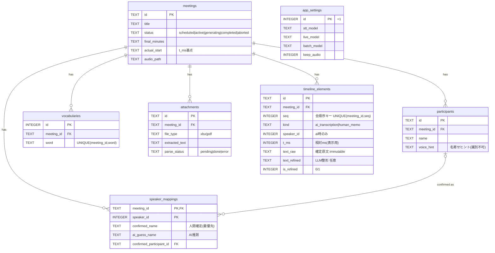

# SynchroniNote データベース設計（正式版・設計の正）

| 版 | 作成日 | 更新日 | ステータス | 由来 |
|----|--------|--------|-----------|------|
| 1.0 | 2026-06-07 | 2026-06-07 | 正式版 | DD-007（DB基本設計）成果物を昇格。[DD-007-5](../../DD/DD-007-5_DB設計の正式版昇格.md) |

> **本書は SynchroniNote のDB設計の Single Source of Truth（生きた設計）。**
> 上位SSOT: [基本設計書.md](../基本設計書.md)（アーキ全体）。カラム定義の正: [データ辞書.md](データ辞書.md)。実行可能スキーマの正: [schema.sql](schema.sql)。
> DD-007-* の添付（対照表・画面項目マトリクス・SSOT訂正反映チェック 等）は**当時の導出・監査スナップショット**であり、本書とずれた場合は本書を優先する。

---

## 1. 全体像（7テーブル）

| テーブル | 責務（1行） | 主キー | 主なFK / ON DELETE | 対応画面 |
|----------|------------|--------|--------------------|---------|
| `meetings` | 会議の基本情報・状態・最終議事録の集約ルート | id | — | S-01/02/03/06/07 |
| `participants` | 会議の参加者（前提情報・話者確定の選択肢） | id | meeting_id→meetings / CASCADE | S-02/03/05 |
| `vocabularies` | 専門用語辞書（プロンプト補正前提） | id | meeting_id→meetings / CASCADE | S-02/05 |
| `attachments` | 参考資料とパース済テキスト | id | meeting_id→meetings / CASCADE | S-02/03 |
| `timeline_elements` | 確定原文＋整形＋人間メモの時系列（議事録の真実源） | id | meeting_id→meetings / CASCADE | S-03/05 |
| `speaker_mappings` | 仮speaker_id→確定/推測名の対応（表示名導出元） | (meeting_id, speaker_id) | meeting_id→meetings/CASCADE, confirmed_participant_id→participants/SET NULL | S-05 |
| `app_settings` | アプリ全体の実行設定（会議非従属・単一行） | id(=1) | — | S-04/08 |

カラムの詳細は [データ辞書.md](データ辞書.md) を参照。

## 2. ER図



## 3. 永続化境界（メモリ ↔ SQLite）

会議中の真実源は **Rust メモリ上のアクター（`SessionState`）**。SQLite へは batch-flush 対象のみ落とす（[基本設計書 §2.2/§3.3/§3.4](../基本設計書.md)）。

| 区分 | 対象 | DB化 |
|------|------|:----:|
| 揮発（メモリのみ） | `AudioChunk` / `RawSegment` / `CleanSegment`（搬送形）/ LLM中間トークン / 仮speaker_idクラスタ途中 / ドロップ計数・遅延ゲージ | ✕ |
| 永続（会議メタ） | 会議基本情報・状態・最終議事録 → `meetings` | ○ |
| 永続（前提情報） | 参加者 / 専門用語 / 参考資料(extracted_text) | ○ |
| 永続（中核） | 確定原文＋整形＋人間メモ → `timeline_elements`（**確定即 flush が耐久性の要**） | ○ |
| 永続（中核） | 話者の confirmed / ai_guess → `speaker_mappings`（表示名は非保持・都度導出） | ○ |
| 永続（音声・任意） | keep_audio ON 時の録音実体 → `meetings.audio_path`（終了後 diarization 再解析用） | ○ |
| 永続（別管理） | アプリ設定 → `app_settings`（会議非従属・単一行） | ○ |

**クラッシュ耐性**: 専用の暫定ログ表は作らず、`timeline_elements` を WAL 有効SQLiteへ確定のたびに逐次 flush することで耐久ログを兼ねる。確定原文は immutable なので部分復旧で破綻しない（復旧手順は §4）。

## 4. ライフサイクル・状態遷移

```
            S-02 保存して予約
[*] ──────────────────────────▶ scheduled
                                   │ S-04 録音開始（status=active, actual_start を単一UPDATEで原子的に記録）
                                   ▼
                                 active ───┐ クラッシュ → 起動時に active 残留を検出
                                   │ S-05 終了    │ → timeline_elements の flush 済み行から復旧
                                   ▼        ◀─────┘
                               generating（モデル切替→特大MoE清書ストリーミング）
                                   │ S-07 保存（status=completed, final_minutes, actual_end, batch_model, generation_seconds を一括UPDATE）
                                   ▼
                               completed ──▶ S-03 で閲覧
```

- **status enum** = `scheduled` / `active` / `generating` / `completed` / `aborted`。`recovering` は永続statusにせずランタイム概念。
- **active 残留**（録音中クラッシュ）: `timeline_elements` の flush 済み行から復元。
- **generating 残留**（清書中クラッシュ）: 起動時に `status='generating'` かつ `final_minutes IS NULL` を検出し、永続済み `timeline_elements` から清書を再実行（または手動 `aborted`）。放置すると S-01 上で「生成中」のまま固着する孤児会議になるため必ず処理する。

## 5. スキーマ適用方針

**マイグレーション機構は持たない**（過去データ移行不要の前提）。

- 起動時に [schema.sql](schema.sql) を冪等適用（`CREATE TABLE IF NOT EXISTS`＋`INSERT OR IGNORE`）するだけ。版管理（user_version）・差分適用・ロールバック・バックアップは不採用。
- スキーマを変えたいときは `.sqlite` を削除して再生成。`CREATE TABLE IF NOT EXISTS` は既存テーブルに変更を反映しないため、「定義を変えたら `.sqlite` を消す」を運用ルールとする。
- 接続ごとに `PRAGMA foreign_keys=ON` 必須（CASCADE/SET NULL を効かせる）。`journal_mode=WAL` / `synchronous=NORMAL`。
- **schema.sql は唯一の正**。実装側（評価期 `python/.../db/`・製品期 `src-tauri/db/`）は本ファイルを**参照/ビルド時コピー**で消費し、編集可能な複製を別管理しない（ドリフト防止）。

## 6. 主要な設計判断（要点）

- **speaker_id は整数仮ID**。`"Speaker_0"` は表示整形。表示名はDBに焼き込まず `confirmed ?? ai_guess ?? "Speaker_{id}"` で都度導出。一括置換＝マッピング差し替えで確定原文は不変。
- **確定原文 text_raw は真実源・immutable**。LLM整形は `text_refined`（別カラム・任意・後追い）。機械ケバ取りは text_raw＋語彙から再導出可で非永続。
- **人間メモは別表化せず `timeline_elements.kind` で統合**。seq を全順序の正とし、メモも挿入位置の seq を採番、読み出しは `ORDER BY seq`。
- **app_settings は会議非従属の単一行**。
- **マイグレーションなし**（§5）。

## 7. 見送り中の防御的制約（記録）

SSOT照合監査（DD-007-5 / 親 [DD-007](../../DD/DD-007_データベース基本設計.md) ログ）で「実在するが単一ライター＋型システムで実害が出ない」と判定し**意図的に見送った** CHECK 群。将来データ蓄積する製品期に一括検討:
`kind↔speaker_id 相関` / `text_refined を ai 限定` / `speaker_id・t_ms・seq の非負` / `completed→final_minutes NOT NULL`。
